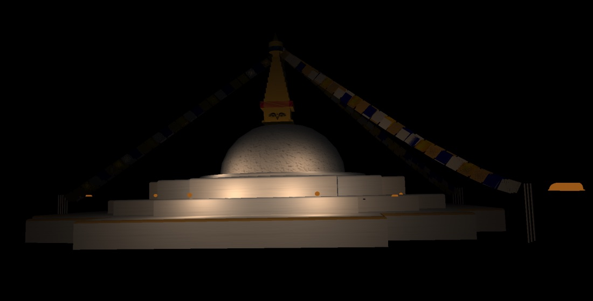

# 3D Modeling and Rendering of Bauddhanath Stupa using OpenGL

## Introduction

This is a Computer Graphics project done in the fifth semester of computer Engineering by:

- Sadhana Panthi (078BCT069)
- Samikshya Bhusal (078BCT074)
- Shalu Khebang (078BCT082)
- Shreya Shrestha (078BCT085)

## Libraries Used

- GLFW
- Glad
- Assimp

## Output
### Day view vs Night view
    

## How to run

This project is built using Visual Studio.

1. Open Visual Studio.
2. Click on run to run the project.

Use A, S, W, and D to move around.\
Press Z for day view and X for night view.

In case of linking errors, You probably need to build the libraries yourself.\
You can use CMake to buid the libraries.

### Helpful links

Visual Studio 2019: https://visualstudio.microsoft.com/downloads/ \
Setting up Libraries: https://learnopengl.com/Getting-started/Creating-a-window \
Learn Opengl: https://learnopengl.com/
